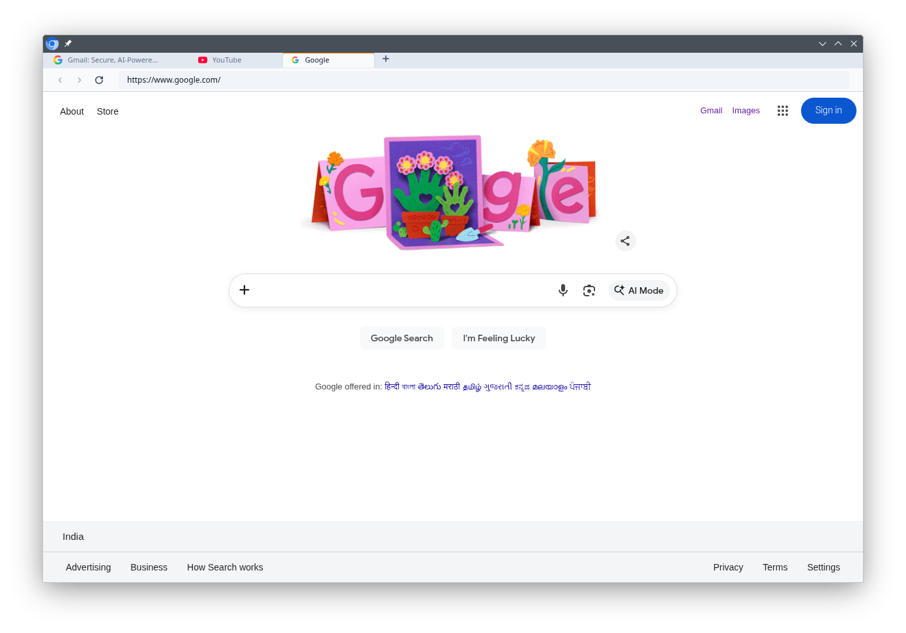

<div align="center">

# OTF Web Browser

**The Modern Lightweight Desktop Browser.**

*Part of the  [Open Tech Foundation](https://github.com/Open-Tech-Foundation) ecosystem.*

[**Report Bug**](https://github.com/Open-Tech-Foundation/Web-Browser/issues)

</div>

> [!WARNING]  
> **Experimental Project**: This browser is in early development. Features, APIs, and stability are subject to significant changes.

A modern lightweight desktop web browser built on top of Chromium Embedded Framework (CEF).

## 📥 Download

You can download the latest version of OTF Web Browser for your platform from our [**GitHub Releases**](https://github.com/Open-Tech-Foundation/Web-Browser/releases) page.

| Platform | Release | Status |
| :--- | :--- | :--- |
| **Linux (x64)** | [Latest Tarball](https://github.com/Open-Tech-Foundation/Web-Browser/releases) | ✅ Stable |
| **Windows (x64)** | TBD | 🚧 In Progress |
| **macOS** | TBD | 🚧 In Progress |



- 🎨 **Modern UI**: Built with React and Tailwind CSS for a premium look and feel.
- ⚡ **High Performance**: Powered by CEF (Chromium) for industry-leading speed and compatibility.
- 🔄 **HMR Support**: Instant UI updates during development without restarting the C++ engine.
- 🛡️ **Privacy Focused**: Built with security and transparency in mind.
- 📦 **Zero Bloat**: Lightweight architecture designed for speed.

## 📦 Installation

Prerequisites:
- CMake (3.21+)
- Ninja (Build system)
- GCC 14+ (C++20 support)
- Bun (for UI development)

```bash
bun run setup
```

## 🛠 Usage

To start the UI development server (with HMR) and launch the browser automatically:

```bash
bun run dev
```

## 🏗 Build

We use **Ninja** for high-performance builds. To build the project for production:

### 1. Build UI Assets
```bash
bun run build:ui
```

### 2. Build C++ Engine
```bash
bun run build:cpp
```

## 📂 Project Structure

- `src/`: Core C++ source files.
- `include/`: C++ header files.
- `ui/`: React frontend source code.
- `third_party/`: External dependencies (CEF SDK).

## 🛡️ Security

OTF Web Browser prioritizes security and minimalism through defense-in-depth:

- **Sandbox Support**: Ready for multi-process sandboxing via CEF/Chromium.
- **Up-to-date Engine**: Regularly updated to the latest CEF/Chromium releases.
- **Open Source**: Transparent codebase for community auditing.
- **Scheme Blocking**: Implemented in `OnBeforeBrowse` to intercept and block dangerous navigations before they reach the renderer. The following schemes are blocked at the request level:

| Scheme | Risk | Blocked |
|---|---|---|
| `chrome://` | Internal Chromium flags and settings | ✓ |
| `chrome-devtools://` | DevTools inspector and debugger | ✓ |
| `chrome-extension://` | Chrome extension APIs (disabled) | ✓ |
| `chrome-search://` | Chrome's built-in search UI | ✓ |
| `chrome-untrusted://` | Sandboxed Chrome UI pages | ✓ |
| `devtools://` | Alternative devtools entry point | ✓ |
| `javascript:` | XSS vector via address bar injection | ✓ |
| `data:` | Phishing via data-URI obfuscation | ✓ |
| `file://` | Local filesystem access (except UI shell) | ✓ |

- **Custom `browser://` Scheme**: Internal pages (newtab, settings) use a registered custom scheme with `CefSchemeHandlerFactory`, isolated from web content and blocked from address bar display.
- **UI Isolation**: The browser toolbar runs in a separate `CefBrowserView` from content pages, preventing page content from interfering with browser controls.

*Note: `about:blank` is preserved for compatibility.*

## 🛣️ Roadmap

- [x] Initial C++/CEF integration
- [x] Modern React-based UI Shell
- [x] Smooth tab management
- [x] Favicon and History support
- [ ] Windows (x64) Support
- [ ] macOS (Universal) Support
- [ ] Automated CI/CD Release Pipeline

## 📄 License

This project is licensed under the [MIT License](LICENSE).
